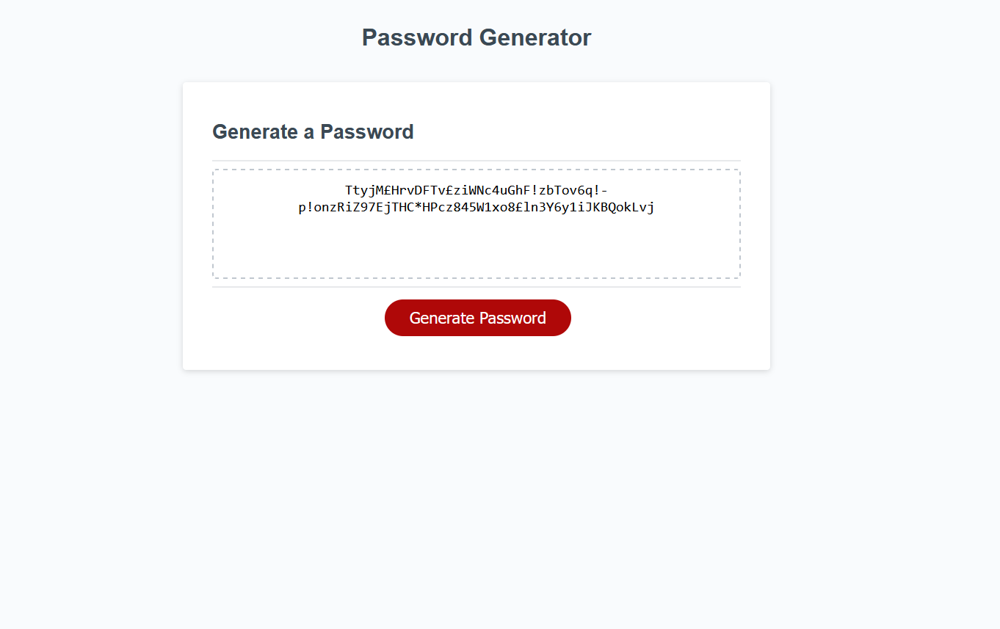

# Thats-So-Random

## A JavaScript based random password generator

### What was my motivation?
It was time to put the long hours of learning JavaScript to use and create fresh code for a very useful application.

### What did I do?
Spent many hours reviewing the past materials and additional resources on the web to create a JavaScript based password generator.

### What did I learn?
How to apply the basic concepts of JavaScript together in code that works and makes sense as well as learning new concenpts such as Math.floor and Math.random.

## Usage.

To view the webpage follow the link and be sure to follow all the user prompts.

(https://nxtera.github.io/Thats-So-Random/)

Screenshot of live page (sample)

 
   
## Credits
Created readme with help from https://coding-boot-camp.github.io/full-stack/github/professional-readme-guide

## License
Please refer to UNLICENSE.txt
